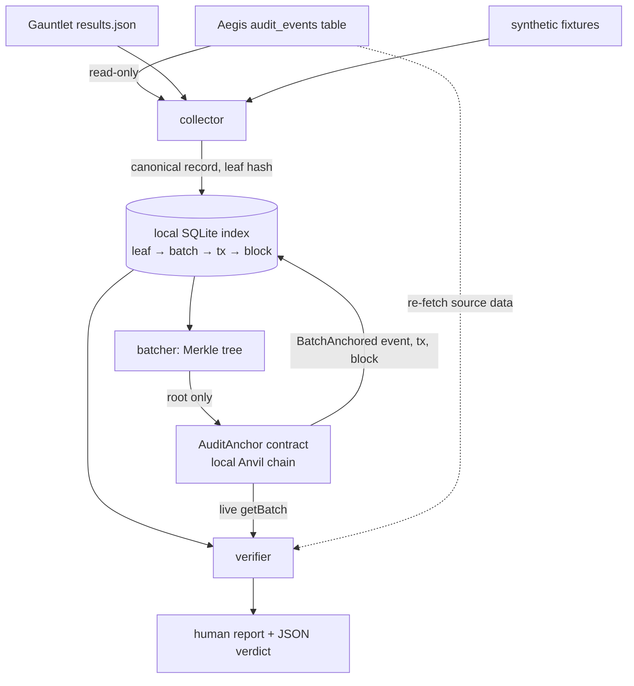

# Ledger

[](https://github.com/Srishti233/Ledger/actions/workflows/ci.yml)

**Tamper-evident proof for your security logs, without trusting any single server.** Ledger takes the hash-chained audit log kept by [Aegis](#relationship-to-aegis-and-gauntlet) (an LLM firewall) and the vulnerability reports produced by [Gauntlet](#relationship-to-aegis-and-gauntlet) (a red-teaming framework), batches their hashes into Merkle trees, and writes only the 32-byte root to a smart contract on a blockchain. Later, anyone can check that a record existed at a given time and has not been edited since, against the chain itself rather than against Ledger's database, Aegis's database, or any one machine. It runs end to end on a free, local, self-hosted chain (Anvil): no paid APIs, no real funds, no accounts.

> **Project 3 of 3.** Aegis blocks attacks and keeps a tamper-evident log. Gauntlet finds what gets through. Ledger proves neither record was quietly edited after the fact.

## What this proves, and what it does not

**Anchoring a hash on-chain proves:** (a) this exact hash existed no later than block N, with a timestamp derived from that block, and (b) nobody can alter the anchored hash after the fact without the alteration being obvious, because changing one historical block would break the chain's own hash-linking, which is independently checkable by anyone running a node.

**It does NOT prove:** that the underlying data (an Aegis audit row, a Gauntlet report) was captured correctly; that Ledger itself did not anchor a wrong hash to begin with; that the anchoring key belongs to the real Aegis or Gauntlet instance; or anything about the real-world truth of what the log claims happened. Ledger's verification reports state this limitation explicitly every time.

Two further honest caveats: the default local chain is a single dev node, so whoever controls it can rewrite history (it demonstrates the mechanism; for independent consensus, anchor to a public testnet/L2, see [Roadmap](#roadmap)); and the contract only accepts batches from an owner-managed allowlist of keys (see [Limitations](#limitations)).

## Architecture



The verifier treats **only the on-chain root as trusted**. Everything Ledger stored locally (leaves, proofs, roots) and the source data are re-checked against it, which is what distinguishes a compromised Ledger database from a compromised Aegis database.

## Quick start

```bash
git clone https://github.com/Srishti233/Ledger.git && cd Ledger
docker compose up --build -d          # Anvil chain + Ledger service (deploys the contract automatically)
./scripts/demo.sh                     # collect → anchor → verify → tamper → detect
```

> **About the private keys in this repo.** `config.py`, `config.example.yaml` and `Deploy.s.sol` contain two `0x...` private keys. They are Anvil's **public development keys** (the same on every developer's machine, documented by Foundry) and control only worthless test ETH on a local chain. A secret scanner may flag them; that is a false positive. Ledger refuses to use them against any non-local RPC URL.

Dashboard: <http://127.0.0.1:8000/dashboard>. The first build downloads the Foundry image and, once, the Solidity compiler. Reset everything (chain and index must be reset together) with `make reset`.

Without Docker: `pip install -e ".[dev]"`, `anvil &`, `(cd contracts && forge build)`, then `ledger deploy && ledger demo`.

## The tamper-detection demo

`scripts/demo.sh` runs `ledger demo` against the real chain and fails unless all of these hold:

1. A batch of synthetic records is collected and anchored; the real transaction hash and gas used are printed.
2. The clean batch verifies, including with the full source record set supplied.
3. **Ledger's own SQLite index is edited directly**, with a recomputed leaf so the row looks self-consistent, simulating a compromised Ledger server. Verification **fails**, names the exact record, and diagnoses `LEDGER_INDEX_MODIFIED`. The row is then restored and verifies again.
4. **A copy of the Aegis audit-table fixture is edited**, simulating a compromised Aegis database. Verification with the full record set **fails for a different, correctly labelled reason**: the index and on-chain root are intact (`recomputed_root_equals_chain_root` passes) but the leaf recomputed from the modified source no longer matches (`SOURCE_DATA_MODIFIED`).
5. A plain-English summary distinguishes what each result proves.

How the two cases are told apart: each record's stored Merkle proof is checked against the **live on-chain root**. A forged index row cannot produce a valid proof for the on-chain root (that would require a SHA-256 preimage), so it fails; a modified source row fails because its fresh hash does not verify through the *untouched* index proof.

Excerpt of the report format (verbatim lines from `ledger demo`, trimmed):

> **Sample provenance:** this transcript was produced by running the demo code against the **in-memory test chain used by the unit tests**, because the build environment had no Docker/Foundry. Its tx hash, block and gas values are test-double values, **not measurements**. A real run against Anvil prints real values; CI runs it on every push.

```text
[4/6] TAMPER with Ledger's own SQLite index (record 13, 13) -- simulating a compromised Ledger server.
== batch 1: TAMPER DETECTED ==
  [ok]   index_root_equals_chain_root: roots match
  [ok]   record_set_complete: 25 records at positions 0..24, chain says 25
  [FAIL] recomputed_root_equals_chain_root: recomputed 57dff4c0cc008505... vs on-chain 7cb56443292dfecb...
  [FAIL] every_record_included_in_onchain_root: 1 record(s) fail their stored leaf/proof against the chain
  [skip] source_full_record_set: full record set not supplied
  Diagnosis:
    - LEDGER_INDEX_MODIFIED: Ledger's local index no longer matches what was anchored on-chain ...
  Records whose index entry fails against the chain: [13]
  What was NOT proven / not checked:
    - whether the original data was captured correctly or is true in the real world.
    - that the anchoring key belongs to the real Aegis/Gauntlet instance.

[5/6] TAMPER with a COPY of the Aegis audit table fixture (row id 13) -- ...
== batch 1: TAMPER DETECTED ==
  [ok]   recomputed_root_equals_chain_root: root recomputed from the indexed leaves equals the on-chain root
  Diagnosis:
    - SOURCE_DATA_MODIFIED: The source data no longer hashes to the leaf that was anchored ...
  Records whose source data no longer matches the anchor: [13]
```

## Evaluation (measured)

Every number below was produced by running the code; nothing is estimated.

**Pure-Python Merkle timings** (measured in the build sandbox: 1 vCPU x86_64, Python 3.12.3; committed as [`results/merkle_bench.json`](results/merkle_bench.json)):

| records | tree build (ms) | proof generate (ms) | proof verify (ms) | proof length |
|---:|---:|---:|---:|---:|
| 1 | 0.001 | 0.0007 | 0.0011 | 0 |
| 10 | 0.019 | 0.0047 | 0.0061 | 4 |
| 100 | 0.168 | 0.0079 | 0.01 | 7 |
| 1000 | 1.709 | 0.0109 | 0.013 | 10 |

**Gas, anchor time, and verification time against the live local chain: not measured in this build.** The build sandbox had no Docker or Foundry, and fabricating chain numbers would violate this project's own rules. They are produced by one command and written to `results/eval.json` and `results/eval.md`:

```bash
docker compose up --build -d && make eval
```

CI runs the same command on every push and uploads it as the `eval-results` artifact; commit its output to `results/` to pin your numbers here. What to expect, by design and verified by an in-repo test rather than by claim: only the 32-byte root is stored on-chain, so `anchorBatch` gas should be essentially constant regardless of batch size (`forge test` has `test_gasIsConstantAcrossBatchSizes`, and the integration suite asserts a spread under 2,000 gas across 1/10/100-record batches on real Anvil). A throwaway warm-up anchor runs first because the very first call on a fresh contract also initialises the batch counter, which costs more; it is reported separately and excluded from the table.

`ledger eval` also prints a clearly labelled **illustrative** cost-per-batch table (assumed gas prices for Ethereum L1 and a typical L2, in ETH, no fiat prices). These are editable assumptions in `ledger/evaluation.py`, not a live feed, and no price API is called.

## CLI reference

`ledger [--config FILE] <command>` (config: YAML plus `LEDGER_*` env overrides, see `config.example.yaml`).

| command | purpose |
|---|---|
| `deploy` | Deploy `AuditAnchor` (or reuse it) and allowlist the anchoring key. Archives a stale index if the local chain was reset. |
| `collect-aegis [--db-url URL] [--limit N]` | Read new `audit_events` rows read-only (Postgres or `sqlite:///file`). Only `id, timestamp, direction, decision, entry_hash` are kept; never the snippet. Exits 3 if Aegis is unreachable. |
| `collect-gauntlet --results results.json [--bypass-key K]` | Hash the whole file plus each bypass finding (`attack_id`, `target_name`, SHA-256 of `variant_text`). Exits 3 if missing. |
| `collect-synthetic [--count N] [--kind aegis\|gauntlet]` | Generate fixture records tagged `source=synthetic`. |
| `anchor-now` | Anchor all pending records (one batch per source, chunked by `batch_size`). |
| `verify --record ID \| --batch ID [--records FILE] [--full] [--no-source] [--json] [--json-out FILE]` | Verify against the live chain. Exit codes: **0** verified, **1** tamper detected, **2** inconclusive (e.g. chain unreachable, which is never reported as a pass). |
| `status`, `record ID`, `proof ID`, `batch [ID]` | Inspect state; `proof` output can be checked offline. |
| `serve [--host --port]` | HTTP API and dashboard. |
| `demo [--count N]` | The tamper-detection walkthrough above. |
| `eval [--sizes 1,10,100,1000] [--out DIR] [--merkle-only]` | Measured evaluation. |

## HTTP API reference

| endpoint | notes |
|---|---|
| `POST /collect/aegis` | Uses the server-side `aegis_db_url` only. The API never accepts a DB URL from callers. |
| `POST /collect/gauntlet` `{"results_path": "results.json"}` | Path must resolve inside `inbox_dir` (default `<data_dir>/inbox`). |
| `POST /collect/synthetic` `{"count": 25, "kind": "aegis"}` | |
| `POST /anchor-now` | Anchors everything pending. |
| `GET /records/{id}`, `GET /records/{id}/proof` | Record, batch, and Merkle proof. |
| `GET /verify/{id}?use_source=true`, `GET /verify/batch/{id}?full=false` | Verdict JSON (always HTTP 200; read `status`). |
| `GET /batches`, `GET /batches/{id}`, `GET /status`, `GET /health` | |
| `GET /metrics` | Prometheus: records collected/anchored/pending, batches, gas spent, anchor latency. |
| `GET /dashboard` | Single self-contained page: pending count, recent batches (tx links via configurable `explorer_tx_url`), verify form, and the proves/does-not-prove box. |

Set `api_key` to require an `X-Ledger-Key` header on the `POST` endpoints. The compose file binds the API to `127.0.0.1`.

## Design notes

* **Merkle tree** (`ledger/merkle.py`): SHA-256, domain-separated (`0x00` leaf prefix, `0x01` node prefix) and sorted-pair hashing. An odd node is **promoted, not duplicated** (duplication lets different leaf lists share a root). Hand-computed tests cover 3, 4, 5 and 7 leaves, single-leaf, and the empty-batch error. Consequence of sorted pairs: a proof shows a leaf is in the tree, not its position.
* **Leaf** = hash of a small canonical JSON record `{v, source, kind, ref, payload}`. No private content enters it: Aegis snippets are excluded and Gauntlet `variant_text` is stored only as its SHA-256.
* **Contract** (`contracts/src/AuditAnchor.sol`): `anchorBatch(root, sourceLabel, recordCount)`, `getBatch(id)`, owner-managed allowlist, custom errors. Duplicate roots are allowed (re-anchoring is harmless; each gets its own id, and the earliest id is the earliest proof). Zero root, empty batch and labels over 64 bytes are rejected. The label is emitted in the event and stored on-chain as its SHA-256, which keeps gas independent of label length.
* **Confirmations**: Ledger waits for `confirmations` blocks and re-checks the receipt's block to catch a reorg. Default 1 (a local automining chain only mines when transactions arrive, so more than 1 would wait forever there).
* **Crash window**: if the process dies after a transaction is mined but before the index is updated, those records stay `pending` and are anchored again, giving a harmless duplicate batch, never a missed record.

## Relationship to Aegis and Gauntlet

Ledger is standalone and touches the other two projects only through the interfaces they already expose; it never modifies their code and every integration degrades gracefully.

* **Aegis**: read-only `SELECT id, timestamp, direction, decision, entry_hash FROM audit_events` over a database URL (Postgres via `psycopg`, or SQLite). The row's `entry_hash` already commits to `prev_hash` and the full entry, so anchoring it covers the whole row. Collection is incremental by `id`. If Aegis is unreachable, the collector reports it and nothing is written.
* **Gauntlet**: reads `results.json`. Gauntlet's exact schema was not available when this was built, so the extractor is deliberately tolerant: it finds lists under the keys `bypasses`, `successful_bypasses`, `findings`, `misses` or `evasions` (override with `--bypass-key`), and each item needs `attack_id`, `variant_text` and `target_name` (or `target`).

**What was exercised in this build: synthetic fixtures only.** The fixtures follow the interface contract above (Aegis rows use the documented schema and the documented `entry_hash` formula, so they form genuine hash chains; the Gauntlet report has the assumed shape). Ledger has **not** been run against a real Aegis database or a real Gauntlet `results.json`. If your Gauntlet output differs, the fix is a one-line `--bypass-key` or an edit to `BYPASS_KEYS` in `ledger/sources.py`.

## What was and was not verified in this build

| area | status |
|---|---|
| Merkle, hashing, store, config, collectors, anchorer, verifier, demo, evaluation, CLI | **Run:** 127 tests passed in the build sandbox via a stdlib-only pytest-compatible runner (real pytest was not installable there), using an in-memory chain double. Spot mutation checks confirmed the tests fail when the tamper logic or sorted-pair hashing is broken. Line coverage on the runnable modules measured about 84% overall with `api.py` and most of `chain.py` unexercised there. |
| Aegis collector over SQLite | **Run** (a table with Aegis's schema). Postgres/`psycopg` path: **not run**. |
| Solidity contract + `forge test` / `forge coverage` | **Not run** (no Foundry in the sandbox). Written to Solidity 0.8.24; reviewed by hand. |
| `web3.py` chain client, deployment, real Anvil integration tests | **Not run.** First executed by CI's `test` job. |
| FastAPI app, dashboard, API tests | **Not run** (FastAPI unavailable in the sandbox). |
| `docker compose up --build`, `scripts/demo.sh`, GitHub Actions | **Not run.** First executed by CI's `demo` job. |

Treat the first CI run as the first real execution of the chain-facing code; it may need small fixes (version drift in `web3`/Foundry/Docker images is the likeliest cause). The `test` job deliberately fails if the integration tests are skipped rather than run.

## Limitations

* **Allowlist trust boundary.** Only allowlisted keys can anchor, so a stranger cannot pollute the ledger with fake batches. A batch proves that *this key* anchored *this hash at this time*, not that the key belongs to the real Aegis/Gauntlet instance. A production deployment should pair this with a signed attestation from Aegis's own key (see Roadmap).
* **Garbage in, garbage out.** Data forged *before* collection is anchored faithfully. Only later changes are detected.
* **Dev chain.** Anvil is one node and its state is ephemeral here (`make reset` wipes chain and index together; `ledger deploy` archives an index orphaned by a chain reset rather than letting it look like tampering).
* **Merkle proofs show membership, not order.** Sorted-pair hashing means a swap of two sibling leaves does not change the root.
* **Gauntlet schema is assumed** (above). **Source re-checks need the source**: if Aegis or the cached copy is gone, verification reports the source check as skipped, and the verdict says so.
* No HTTP user accounts; see `SECURITY.md`.

## Responsible use

For protecting the integrity of your own audit logs and security reports. Read [`SECURITY.md`](SECURITY.md) for the trust model and reporting. Gauntlet findings can describe real weaknesses; treat the index and cached source copies as sensitive. Use only test networks and throwaway keys.

## Roadmap

* Signed attestations from Aegis's own key, verified before anchoring, so the anchor binds to the real producer.
* An optional free public-testnet (or L2) deployment guide for chain history you do not control. The config already supports it (`allow_non_local_chain`, your own throwaway keys, `explorer_tx_url`); Ledger refuses Anvil's public test keys on any non-local chain.
* Persisted Anvil state / Hardhat alternative; multi-source batches; anchor-cost dashboards.

## Repository layout

```
contracts/   AuditAnchor.sol (src/), Foundry tests (test/), Deploy.s.sol (script/), foundry.toml
ledger/      api, cli, merkle, collector, sources, anchorer, verifier, chain, config, models,
             store, service, demo, evaluation, dashboard, fixtures/ (synthetic generators)
tests/       unit, API, and real-chain integration tests
scripts/     demo.sh
results/     committed measured evaluation output
```

MIT licensed, copyright Srishti.
